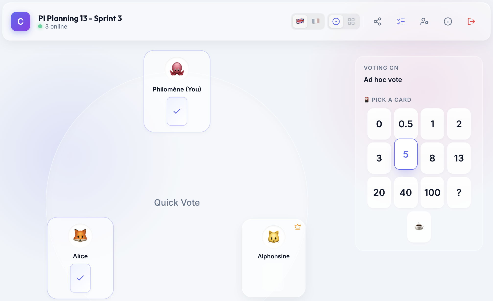

# Conclave

Yet another planning poker tool.



## Features

- No account, no login, no subscription needed
- Vote on specific tasks, or ad-hoc without a selected item
- Vote result aggregation with distribution chart and majority highlight
- Round history preserved per task
- Configurable countdown timer
- Auto-reveal votes when the timer ends (optional)
- Admin remote control via QR code (vote from your phone while presenting)
- Room sharing via QR code, invite link or room ID
- Card deck presets (Standard, Fibonacci, T-Shirt) or fully custom
- Emoji avatars
- Internationalized (English and French)
- Automatic dark mode following system preference
- Circle view or grid view
- Mobile and desktop friendly
- Recent rooms history stored locally
- Room is deleted after 48H of inactivity
- Admin role can be transferred to another participant
- Anonymous voting mode (votes are revealed without showing who voted what)


## Tech Stack

React, TypeScript, Vite with Cloudflare Wrangler plugin, WebSockets, Cloudflare 
Workers & Durable Objects.

See:

- [`docs/architecture.md`](docs/architecture.md) for a detailed breakdown
- [`docs/protocol.md`](docs/protocol.md) for the communication protocol and identity model


## Live Instance

Hosted at https://conclave.alea.net

It may be retired in case of abuse, or if the Cloudflare free plan is no longer
sufficient. It is provided **as-is**, without warranty or support of any kind.
The author(s) make no guarantee regarding data integrity, compatibility across
versions, or fitness for any particular purpose. **You are responsible for 
maintaining your own backups.** The author(s) shall not be liable for any data 
loss, corruption, or damages arising from the use of this software.


## Development

### Prerequisites

- **Node.js** (v24.15.0 or later)
- **npm** (v11.12.1 or later)
- **Cloudflare Account** (required for production deployment with Durable Objects)

All tests were performed under a macOS environment.

### Install Dependencies

```bash
npm install
```

### Local Development

Vite is configured with the Cloudflare Wrangler plugin which starts both the
client dev server and a local Durable Objects backend.

```bash
npm run dev
```

### Build for Production

```bash
npm run build
```

Output (client + Cloudflare Worker) goes to `client/dist`.


## Deployment

> [!IMPORTANT]
> Current `server-cloudflare/wrangler.toml` file is configured for deployment on 
> https://conclave.alea.net - you probably need to change that.

1. Create a Cloudflare account
2. In Workers & Pages, create a new application
3. Configure a GitHub link referencing this project or a fork

Build configuration:

- Build command: `npm run build`
- Deploy command: `npx wrangler deploy --cwd client`
- Root directory: `/`


## Data and privacy

- Data is stored in your browser's local storage (profile, recent rooms, custom deck)
- Room data lives on the server only for the lifetime of the room (48H max inactivity)
- Cloudflare Analytics may be used, but no cookies are set and no per-user data or tracker is collected


## License

This project is licensed under the MIT License — see the [LICENSE](LICENSE) file for details.
