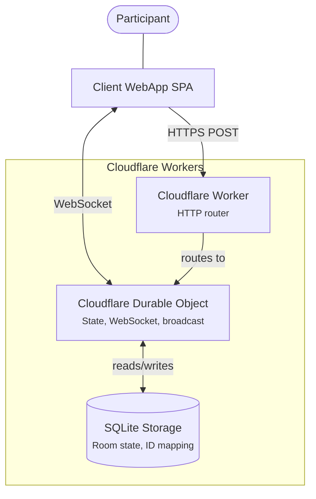

# Conclave Architecture

## System Overview



## Design Principles

### Backend independence

The project is organized so that it could evolve to use a different backend. Cloudflare tooling is used today (Durable Objects, Wrangler, Vite Wrangler plugin), but the client communicates exclusively via standard protocols (HTTP, WebSocket) without any proprietary SDK or library.

### Full state broadcast

On every mutation, the server broadcasts the complete `RoomState` to all connected clients. This simplifies the client (no partial patching, no conflict resolution) at the cost of slightly larger messages — acceptable given the small state size of a planning poker room.

### Stateful server, stateless client

The server is the single source of truth. The client holds no authoritative state — it renders whatever the server sends. On reconnection, the client receives the full current state immediately.

## Project Structure

```
conclave/
├── client/              # React SPA (Vite + Cloudflare Wrangler plugin)
│   └── src/
│       ├── components/  # Reusable UI components
│       ├── hooks/       # React hooks (useRoomSession, etc.)
│       ├── i18n/        # Internationalization (EN, FR)
│       ├── services/    # WebSocket client, user/settings persistence
│       └── views/       # Page-level components (Landing, Room, etc.)
├── server-cloudflare/   # Cloudflare Worker + Durable Object
│   └── src/
│       ├── index.ts     # HTTP router (room creation, WebSocket upgrade)
│       └── conclave-room.ts  # Durable Object (room logic, state, broadcast)
├── shared/              # Shared TypeScript package
│   └── src/
│       ├── index.ts     # Types (RoomState, Participant, SocketMessage, ServerMessage)
│       └── id.ts        # ID generation (room IDs, user IDs)
└── docs/
    ├── architecture.md  # This file
    └── protocol.md      # Communication protocol and identity model
```

## The Client

A React single-page application built with Vite. Key characteristics:

- No dependency on backend-specific libraries — communicates via standard WebSocket and HTTP
- State is received from the server and rendered directly (no local state reconciliation)
- User identity (`userId`) is generated and persisted in `localStorage`
- The `publicId` (received from the server at join time) is used to identify the current user in the participant list

## The Backend

A Cloudflare Worker with a Durable Object per room.

### HTTP Router (`index.ts`)

Minimal router with two endpoints:
- `POST /api/rooms` — creates a room, returns the generated room ID
- `GET /api/rooms/:roomId/ws` (Websocket Upgrade) — proxies the WebSocket connection to the room's Durable Object

### Room Durable Object (`conclave-room.ts`)

Each room is an isolated stateful instance that:
- Manages the participant list, tasks, rounds, votes, timer, and admin role
- Authenticates users via their `userId` at join time, then operates entirely on `publicId`
- Broadcasts the full state to all connected WebSockets on every change
- Persists state and the `userId → publicId` mapping in SQL storage
- Supports the Hibernation API — WebSocket connections survive memory eviction
- Self-destructs after 48 hours of inactivity via an alarm

## Shared Library

The `conclave-shared` package contains:
- **Types**: `RoomState`, `Participant`, `Round`, `Task`, `SocketMessage` (client→server), `ServerMessage` (server→client)
- **ID generation**: `generateRoomId()` (nanoid with custom alphabet), `generateUserId()` (crypto.randomUUID)
- **Constants**: `DEFAULT_DECK`

It is referenced by both `client` and `server-cloudflare` via npm workspaces.

## See Also

- [`docs/protocol.md`](protocol.md) — communication protocol, identity model, and message flow diagrams
