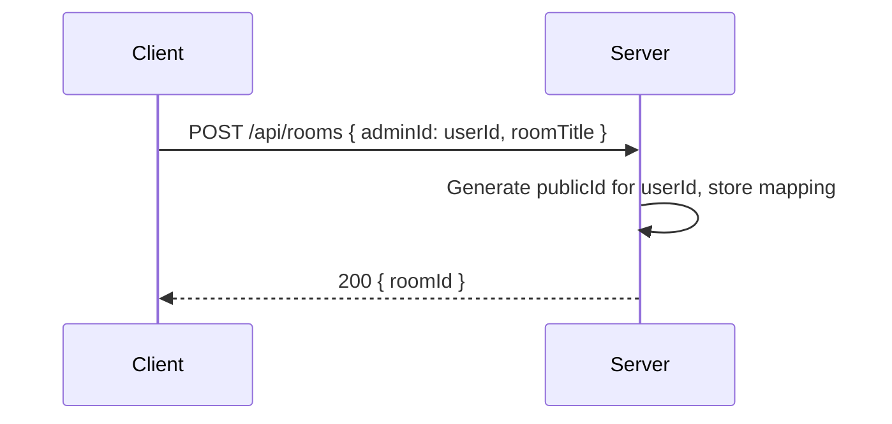
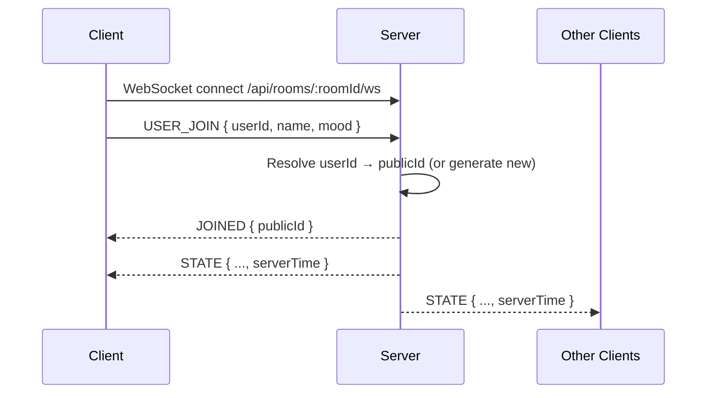
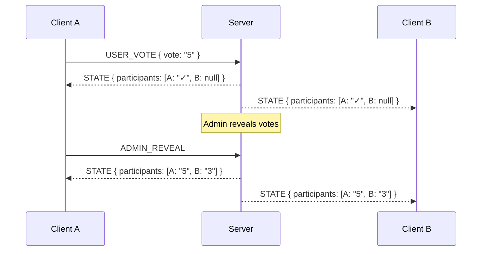

# Protocol

## Overview

Conclave uses HTTP for room management (creation) and WebSockets for real-time state synchronization between participants. The WebSocket protocol is message-based (JSON), with a clear separation between client→server messages (`SocketMessage`) and server→client messages (`ServerMessage`). Both types are defined in the `conclave-shared` package.

## Identity Model

Two identifiers coexist for each user:

### userId (private)

- Generated client-side via `crypto.randomUUID()`
- Persisted in `localStorage` — stable across sessions and page reloads
- Sent to the server **only** in the `USER_JOIN` message (point-to-point on the user's own WebSocket)
- Never broadcast to other participants

### publicId (public)

- Generated server-side via `crypto.randomUUID()` at room creation or first join
- Persisted in the server's SQL key-value store (`userIdMapping`)
- Used everywhere in the room state: `participants[].id`, `adminId`, `Round.votes` keys
- Broadcast to all participants — visible to everyone in the room
- Stable for a given user within a room (survives reconnection), but opaque and unguessable

### Security Properties

- An attacker observing WebSocket traffic sees only publicIds, never userIds
- Knowing someone's publicId does not allow impersonation — the server authenticates via the userId sent during `USER_JOIN`
- The publicId is a UUID (122 bits of entropy), making brute-force impractical

## Room IDs

- Generated client-side using `nanoid` with a custom alphabet (no ambiguous characters: `0`, `O`, `1`, `l`, `I` excluded)
- 10 characters long — short enough to share easily

## Room Creation

1. The client sends an HTTP POST with `{ adminId: userId, roomTitle }` to create a room
2. The server generates a publicId for this userId and stores the mapping
3. The `adminId` in the persisted room state is set to the publicId (not the userId)
4. The room is now ready to accept WebSocket connections

## Connection and Join

1. The client opens a WebSocket to `/api/rooms/:roomId/ws`
2. On connection, the client sends a `USER_JOIN` message containing its `userId`, display name, and mood emoji
3. The server resolves the userId to an existing publicId (reconnection) or generates a new one
4. The server responds with a `JOINED` message containing the assigned `publicId`
5. The client stores this publicId in memory and uses it to identify itself in subsequent state updates
6. The server broadcasts the full room `STATE` (with `serverTime`) to all connected clients

## State Broadcast

The server sends the full `RoomState` on every mutation. The state contains:

- Participant list (with publicIds, names, moods, admin flag, and masked/revealed votes)
- Task list with round history
- Current task, deck configuration, timer state
- The `adminId` field (as a publicId)

Vote masking: before reveal, other participants' votes appear as `"✓"` (voted) or `null` (not voted). After reveal, actual vote values are shown.

## Message Types

### Client → Server (`SocketMessage`)

- `USER_JOIN` — authenticate and join the room
- `USER_UPDATE_PROFILE` — change display name or mood
- `USER_VOTE` — cast or retract a vote
- `ADMIN_*` — admin-only actions (reveal, reset, manage tasks, deck, timer, transfer admin, rename room)

### Server → Client (`ServerMessage`)

- `JOINED` — sent once after `USER_JOIN`, contains the client's `publicId`
- `STATE` — full room state broadcast to all clients on every change, includes `serverTime` for clock synchronization (see Architecture)
- `error` — error notification

## Persistence

- The room state and the `userIdMapping` are persisted server-side (survives server restarts)
- WebSocket connections are stateful — if the server restarts, clients must reconnect and re-join

## Room Lifecycle

- Rooms expire after 48 hours of inactivity (no WebSocket messages)
- On expiry, all storage is deleted and connected WebSockets are closed with a standard close code
- There is no explicit "room deleted" message in the protocol — clients detect the room disappearance via the WebSocket close event
- The inactivity timer resets on every incoming message
- There is currently no way to manually delete a room
